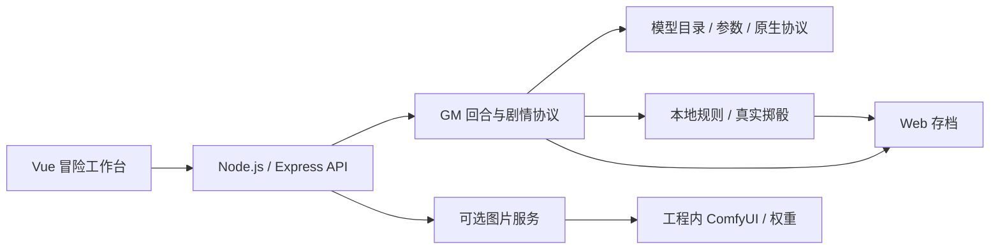

# RPG 文字冒险

一个在本机运行的文字冒险游戏，使用 Vue 网页、Node.js 后端、规则引擎与存档。玩家输入行动，AI 担任 GM 推进剧情；需要判定时，由本地规则引擎真实掷骰，再把结果交给模型续写，最终结算并保存游戏状态。

文字模型在启动后的网页中配置，支持 **DeepSeek 官方 API、OpenCode Go 订阅 API、Anthropic Messages 兼容 API**，并保留通用 OpenAI 兼容服务与本地演示模式。本地图片生成是可选功能，默认关闭。

- [快速开始](#快速开始)
- [配置文字大模型](#配置文字大模型)
- [冒险工作台与游戏流程](#冒险工作台与游戏流程)
- [可选本地图片生成](#可选本地图片生成)
- [项目架构与目录](#项目架构与目录)
- [更新与配置迁移](#更新与配置迁移)
- [开发与验证](#开发与验证)
- [文档索引](#文档索引)

## 快速开始

文字游戏需要 Node.js **22 或更高版本**、npm 和浏览器。仅玩文字冒险不需要显卡、Python、CUDA、ComfyUI 或图片模型权重；使用线上模型时需要网络与对应服务的 API Key。

### Windows 启动

1. 把工程放在可写目录中。
2. 首次使用运行根目录的 [安装项目依赖.bat](安装项目依赖.bat)，安装 Web 依赖并构建前端。
3. 运行 [启动游戏.bat](启动游戏.bat)，浏览器打开 [游戏首页](http://127.0.0.1:8000/)。
4. 在自动打开的设置中配置模型，或选择演示模式。
5. 打开「冒险与存档」，选择冒险本、角色和槽位，开始游戏。

启动脚本优先使用工程内的 `ai/runtime/node/node.exe`，缺少时使用系统 Node。仅从 Git 克隆的工程不包含运行时、依赖、图片权重和前端构建产物；请先准备 Node/npm，再运行安装脚本。完整工程已有运行时、依赖和构建时，可直接启动。

通过启动脚本运行时保持窗口打开，Ctrl+C 停止服务。需要更换端口时，在 PowerShell 中执行：

```powershell
& '.\启动游戏.bat' 8001
```

然后访问 `http://127.0.0.1:8001/`。完整环境要求与故障处理见 [环境配置指引](docs/环境配置指引.md)。

### 终端启动

在工程根目录使用系统 Node/npm 执行：

```powershell
npm.cmd --prefix web ci
npm.cmd --prefix web/client ci
npm.cmd --prefix web/client run build
node web/server/index.js 8000
```

服务默认监听 `127.0.0.1`，供本机浏览器访问。

## 配置文字大模型

点击顶部模型入口或「模型与界面设置」，选择「连接模型 API」，再选择服务：

| 服务 | 默认基础地址 | 认证方式 | 接入协议 |
|---|---|---|---|
| DeepSeek 官方 API | `https://api.deepseek.com` | Bearer API Key | Chat Completions |
| OpenCode Go 订阅 | `https://opencode.ai/zen/go/v1` | Go 订阅账户的 API Key | 按模型使用 Messages、Responses 或 Chat Completions |
| Anthropic 兼容 API | `https://api.anthropic.com/v1`，可改为兼容网关 | x-api-key；网关可选 Bearer 或无需密钥 | Anthropic Messages |
| 通用 OpenAI 兼容服务 | 按服务商或本地服务填写 | Bearer 或无需密钥 | Chat Completions |
| 演示模式 | 无需地址和密钥 | 无需认证 | 本地示例叙述 |

新环境预填 DeepSeek 地址，**模型 ID 和密钥留空**。配置不完整时使用演示回复，网页会引导进入设置。

配置流程：

1. 选择服务，确认基础地址并填写对应 API Key。
2. 点击「刷新模型」，搜索并选择模型。OpenCode Go 读取 Go 接口返回的全部条目，模型数量和可用权限以刷新结果及实际服务响应为准。
3. 按模型能力设置思考模式、effort 等级、思考预算、最大输出 tokens、temperature、top_p、超时和流式输出。
4. 点击「测试连接」，确认候选配置能够收到模型正文。
5. 点击 **「保存配置」**，下一次游戏行动使用新配置，重启后恢复。

模型目录查询不发送生成请求。连接测试使用所选模型和参数发送一条短请求，最多等待 30 秒，会使用对应账户额度；**测试成功后仍需保存配置**。

参数适用规则由前后端共同校验，模型不支持的控件会禁用，相关字段不会发送。切换服务或模型时重置参数，避免沿用无效思考等级；能力未知的高级选项不推测。Anthropic / OpenAI 兼容服务未提供模型目录时可手填模型 ID。输出长度需要为思考、剧情正文和末尾结构化状态留足空间。

实际配置写入 `web/config.json`，无密钥模板见 [web/config.example.json](web/config.example.json)。重新打开设置时密钥框为空，只显示已保存标记和尾号；同一服务、地址与认证方式下留空保留密钥，勾选清除会删除。切换服务、地址、认证或运行方式且未填新密钥时，旧密钥会清除。

专用 Kimi 登录与 OAuth 凭证读取已移除。Go 完整目录中仍可能包含其提供的 Kimi 系列，选择这些模型时使用 Go 密钥。参数详情与迁移规则见 [环境配置指引](docs/环境配置指引.md)，协议实现见 [模型接入架构](docs/模型接入架构.md)。

## 冒险工作台与游戏流程

工作台提供九个功能页，桌面使用左侧导航，手机通过菜单切换。图表和资料来自当前存档的公开状态。

| 页面 | 当前功能 |
|---|---|
| 冒险 | 剧情流、行动输入、建议、真实骰子判定、插图和状态摘要 |
| 角色档案 | 背景、属性雷达、技能、资源、特质、状态与经验成长 |
| 世界地图 | 地点连接图、路线、耗时、风险、地点详情与前往操作 |
| 装备背包 | 物品、数量、资金、负重和使用物品的行动入口 |
| 进度与威胁 | 已出现的分段进度钟、推进情况与公开后果 |
| 人物关系 | 已相识人物的公开资料、关系刻度与互动入口 |
| 线索板 | 已发现与已解决线索、调查入口和解决进度 |
| 事件与日志 | 已触发事件、待处理事件和游戏记录 |
| 战斗准备 | 当前防御、基础判定加值、资源、状态、物品与特质 |

初始装备、资金和已知关系来自角色卡。之后的物品获得与消耗、人物相识与关系变化、线索发现与解决、进度与威胁推进，都通过玩家行动和 GM 回合结算解锁、保存。玩家不能在资料页自由添加或修改这些记录；角色成长需要消耗已获得的经验。

地图、人物、物品、线索和建议按钮可以填写行动草稿，发送后才执行。地图的「前往」执行移动并结算耗时与事件。功能页切换保留故事和草稿；切换冒险本或存档槽位会清除上一角色的草稿。每个冒险本提供三个 Web 存档槽位。

「停止显示」结束浏览器接收，后端继续结算；前端同步最终存档后才能再次行动。未知人物的秘密和未触发事件不提前展示。

**战斗目前只实现准备面板，战斗回合、敌方行动、攻击与伤害结算尚未接入。** 界面操作、组件职责和战斗扩展方案见 [前端界面与战斗扩展](docs/前端界面与战斗扩展.md)。

## 可选本地图片生成

在「设置 → 图片生成（可选）」中展开配置，选择模型，点击「检测并配置」：

1. 检查后端电脑的 GPU、显存、驱动、内存、CPU 逻辑线程和磁盘空间。
2. 达标后自动下载并配置工程内的 Python、ComfyUI、依赖和所选权重，已有文件校验后复用。
3. 全部完成才启用；实际请求剧情插图、地点图或头像时，才启动服务并加载模型。
4. 未达标时显示失败项，并提示可使用图片 API；图片 API 接入目前尚未实现。

当前配方采用以下项目安装门槛，完整要求以网页检测报告为准：

| 配方 | NVIDIA 显存 | 内存 | CPU 逻辑线程 |
|---|---:|---:|---:|
| Z-Image-Turbo + Qwen3 | ≥ 16 GiB | ≥ 32 GiB | ≥ 4 |
| Qwen-Image 2512 FP8 | ≥ 24 GiB | ≥ 48 GiB | ≥ 8 |

自动安装目前支持 Windows x64。默认未配置时不会检测硬件、启动 ComfyUI 或加载图片模型；配置成功后，游戏启动也不会预加载。安装支持进度展示、取消和下载续传；关闭图片功能会停止项目创建的生图进程，保留已下载文件。

Z-Image 基础配方已完成本机实际出图验证，Qwen-Image 2512 配方的完整本机出图尚未验证。详细门槛、权重、工作流、目录和验证方法见 [本地图片生成说明](ai/README.md)。

## 项目架构与目录

前端提交行动意图，后端组织模型上下文与 GM 回合；本地规则负责真实掷骰、状态校验和存档。模型传输、生图环境管理与游戏规则分别实现。



```text
role_play2/
├── README.md                    项目入口
├── 安装项目依赖.bat              安装 Web 依赖与构建网页
├── 启动游戏.bat                  启动本机服务
├── docs/                        环境、模型架构与界面说明
├── core/                        通用 RPG 规则与模板
├── modules/                     冒险本内容、地图、事件和角色卡
├── web/
│   ├── config.example.json      无密钥配置模板
│   ├── config.json              本机模型与图片设置
│   ├── client/src/              Vue 工作台
│   ├── client/dist/             前端构建产物
│   ├── server/
│   │   ├── engine/              规则、骰子、模块加载和存档
│   │   ├── llm/                 模型目录、能力、原生请求与流解析
│   │   ├── image/               硬件检测、安装、进程和出图服务
│   │   ├── routes/              HTTP / SSE 接口与公开视图
│   │   └── gm.js                GM 上下文、剧情、判定与续写
│   ├── shared/                  前后端共用的玩家权限与模型参数规则
│   ├── saves/                   Web 玩家存档
│   └── assets/                  已生成图片
└── ai/
    ├── profiles.json            生图配方、组件与硬件门槛
    ├── workflows/               ComfyUI 工作流
    ├── runtime/                 项目内 Node / Python
    ├── vendor/ComfyUI/           第三方程序
    ├── models/                  图片模型权重
    └── data/                    安装任务、断点、日志与缓存
```

新增冒险本按 [模块规范](modules/README.md) 放入 `modules/<本名>/`，核心规则与具体剧情内容分开。模块的 Markdown 初始存档用于内容定义，网页运行中的玩家存档位于 `web/saves/`。

模型客户端只把正文交给 GM。推理内容不进入剧情流或存档；同回合的签名和加密内容用于判定后的续写。模型输出截断、流错误或提前断开时中止状态提交，保留原存档。

## 更新与配置迁移

| 改动 | 生效方式 |
|---|---|
| 前端源码或依赖 | 重新安装所需依赖、构建前端，再刷新网页 |
| 后端源码或依赖 | 停止原后端进程，安装所需依赖，再启动服务 |
| 网页模型设置 | 测试后保存，下一回合生效，无需重启 |
| 图片模型或设备 | 通过「检测并配置」重新完成检测与安装 |
| 旧 Kimi 登录配置 | 新后端加载后转为待配置状态，不再读取本机登录凭证 |

代码更新后可以运行 `安装项目依赖.bat` 更新依赖与网页构建，再重新启动服务。**只刷新网页不会让旧后端进程加载新源码。** 更新后仍显示旧模型时，确认原进程已停止、新服务已启动，并刷新网页、检查当前配置；测试连接也不会替代保存。

`web/config.json` 保存本机密钥，网页读取只返回掩码。个人配置、玩家存档、生成图片、下载权重、运行时和缓存由 Git 忽略，提交与分享源码使用无密钥模板。更新源码时保留自己的配置和存档；迁移机器后，本地图片环境需重新检测。

## 开发与验证

在工程根目录执行：

```powershell
npm.cmd --prefix web run verify
npm.cmd --prefix web/client run build
```

`verify` 执行 JavaScript/Python 规则一致性检查、Node 回归测试和服务端模块加载检查。完整检查需要可用的 Python；日常文字游戏通过 Node.js 运行。

可单独执行回归测试：

```powershell
npm.cmd --prefix web test
```

最近一次完整功能验证通过 **114 项 Node 回归、29 项规则一致性检查和 Vite 构建**，并使用桌面与手机浏览器检查模型配置及真实掷骰后的续写。测试使用本机假模型、临时配置或内存存档，不消耗个人线上模型额度。

开发时在两个终端中分别运行以下命令，前端开发服务的具体地址以 Vite 输出为准；默认代理到 8000 端口的后端：

```powershell
npm.cmd --prefix web run dev
npm.cmd --prefix web/client run dev
```

本地 GPU 实际出图验证会加载模型，使用 [本地图片生成说明](ai/README.md) 中的显式验证流程。

## 文档索引

| 文档 | 内容 |
|---|---|
| [环境配置指引](docs/环境配置指引.md) | 环境要求、启动、模型参数、配置迁移和常见问题 |
| [模型接入架构](docs/模型接入架构.md) | 模型目录、参数校验、三种原生协议、推理隔离与续写 |
| [前端界面与战斗扩展](docs/前端界面与战斗扩展.md) | 九个功能页、解锁与结算、组件职责和战斗接入方案 |
| [本地图片生成说明](ai/README.md) | 硬件门槛、自动安装、权重、进程管理与出图验证 |
| [模块规范](modules/README.md) | 冒险本结构、清单文件与核心规则解耦 |
| [无密钥配置模板](web/config.example.json) | 可提交、可分享的模型与图片设置示例 |
| [开发记录](PROGRESS.md) | 已完成工作、验证结果与待接入功能 |
