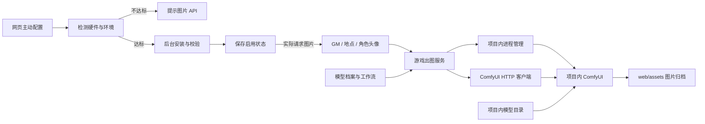

# 可选本地图片生成

文字模型 API、Node.js 安装与完整启动步骤见 [环境配置指引](../docs/环境配置指引.md)。

图片功能默认关闭。启动游戏、读取存档和未配置的状态查询不会启动 Python/ComfyUI、检测 GPU 或加载模型；旧配置的 `auto_start: true` 不会启用新流程。程序、Python/CUDA 依赖与权重由工程内的安装任务管理，日常运行不依赖 `F:\ai` 或系统 Python。

## 网页配置流程

打开「设置 → 图片生成（可选）」，打开「配置本地图片生成」，选择模型后点击「检测并配置」。开关只展开配置，按钮才开始实际配置。

1. 检查运行游戏后端的电脑：GPU/显存/算力/驱动、内存、CPU 逻辑线程，以及工程磁盘。远程打开网页时检测的是后端电脑。
2. 不达标时展示失败项，建议图片 API 或升级硬件，不下载、不安装。图片 API 目前只有提示，没有接口实现。
3. 达标后自动安装独立 Python、固定版本 ComfyUI、CUDA/PyTorch 依赖与所选权重；已有环境和文件校验后复用。
4. 任务在后台运行，展示阶段和当前文件进度；可关闭设置窗口、取消或重试。下载支持续传，大小和 SHA256 通过后原子改名。
5. 全部完成才保存启用状态。实际请求图片时才启动 ComfyUI、加载模型，启动游戏仍不会预加载。

关闭图片开关会取消安装、关闭功能并停止游戏创建的生图进程，下载文件保留。关闭整个游戏会取消任务与释放自有进程。服务重启后的未完成任务显示中断，用户点击配置才恢复。配置任务不持有玩家存档锁，不阻塞文字游戏。

## 当前安装策略

| 配方 | NVIDIA 显存 | 内存 | CPU 逻辑线程 | 必要模型文件 |
|---|---:|---:|---:|---:|
| Z-Image-Turbo + Qwen3 | ≥ 16 GiB | ≥ 32 GiB | ≥ 4 | 约 19.27 GiB |
| Qwen-Image 2512 FP8 | ≥ 24 GiB | ≥ 48 GiB | ≥ 8 | 约 28.00 GiB |

自动安装当前支持 Windows x64、CUDA 算力 ≥ 8.0、驱动 ≥ 570.65，使用 CUDA 12.8 的 PyTorch 2.9.1 / torchvision 0.24.1。内存允许 0.5 GiB 的系统硬件占用容差；磁盘按缺失文件、断点和临时空间计算。多卡机器保存符合要求的设备号，检查和实际运行使用同一张卡。空闲显存/内存不足时提示关闭其他应用。

这是当前配方的保守安装策略，CPU、内存与 Qwen 显存门槛不代表模型理论最低需求，也不保证所有场景的速度和内存峰值。调整策略在 `profiles.json`；固定程序版本、大小与校验值在 `downloads.json`。

程序与依赖来自 Python.org、GitHub、PyPI、PyTorch 官方站点；模型优先使用同一 Comfy-Org 发布者的 ModelScope 仓库，Hugging Face 为备用源，两者按同一 SHA256 验收。网页不接受任意下载地址或执行命令。

## 目录与职责

```text
ai/
├── profiles.json              模型组件、SHA256、参数与硬件门槛
├── downloads.json             固定版本 Python / ComfyUI / pip 安装清单
├── workflows/                 ComfyUI API 工作流模板
├── bootstrap.py               项目内 Python 启动与依赖检查
├── extract.ps1                解压安装包，拒绝越界路径
├── requirements.install.txt   自动安装的 ComfyUI 依赖
├── requirements.lock.txt      原本机导入环境的依赖版本记录
├── vendor/ComfyUI/            第三方程序与原始许可证
├── runtime/
│   ├── python/                标准库、CUDA 与 Python 包
│   ├── node/                  游戏后端的 Node.js 与 npm
│   └── install.json           导入记录、模型大小和 SHA-256
├── models/
│   ├── diffusion_models/      图像生成主模型
│   ├── text_encoders/         提示词编码器
│   ├── vae/                   图像解码器
│   └── loras/                 模型附加权重
└── data/                      安装任务、下载断点、日志、临时文件及缓存

web/server/image/
├── profiles.js                档案读取与模板填充，无网络或进程操作
├── hardware.js                按请求检测与评估硬件，不调用 torch
├── download.js                流式下载、重试、续传与完整性校验
├── install.js                 工程内环境与权重安装、缓存复用与路径边界
├── setup.js                   单个配置任务、取消/恢复、成功后启用
├── runtime.js                 启动、就绪探测、进程归属和关闭
├── comfyClient.js             节点校验、提交、轮询与获取 PNG
└── service.js                 游戏提示词、出图编排与图片归档
```

`web/server/comfy.js` 保留为兼容入口。GM、头像和地点出图都调用同一个服务，游戏规则与存档引擎不负责管理 Python 进程。



## 已导入的模型

当前可用档案为 `z-image-turbo`，对应本机原有的四个组件：

| 职责 | 文件 |
|---|---|
| 主模型 | `diffusion_models/z_image_turbo_bf16.safetensors` |
| Qwen3 文本编码器 | `text_encoders/qwen_3_4b.safetensors` |
| VAE | `vae/ae.safetensors` |
| 可选 LoRA | `loras/NSFW_master_ZIT.safetensors` |

默认基础配方为 1024×1024、8 步、CFG 1，不依赖可选 LoRA，自动安装也不会下载它。原 LoRA 文件保留，显式指定强度时可使用。模型按出图任务载入，ComfyUI 自动管理显存。基础组件与配方依据 [Z-Image-Turbo 官方示例](https://docs.comfy.org/tutorials/image/z-image/z-image-turbo)。

`qwen-image-2512` 使用 Qwen-Image FP8 主模型、Qwen2.5-VL 编码器与 Qwen-Image VAE。原 `F:\ai` 没有这些权重，网页选择并通过检测后才下载。其标准工作流依据 [ComfyUI 官方示例](https://docs.comfy.org/tutorials/image/qwen/qwen-image-2512)；此档案尚未完成本机实际生图验证。

## 启动与操作

在工程根目录运行 `启动游戏.bat`，优先使用项目内 Node.js。游戏启动时图片默认关闭；配置成功后也仅在实际出图时按需启动服务。

网页区分缓存存在、配置可按需生成、服务运行中。内部服务只监听 `127.0.0.1`，禁用联网 API 节点和自定义节点；模型、缓存和所有 ComfyUI 写入目录位于 `ai/`。通用配置接口不能跳过检测直接启用图片功能。

配置的 `image_generation` 字段：

```json
{
  "mode": "internal",
  "enabled": false,
  "configured_at": null,
  "profile": "z-image-turbo",
  "device": 0,
  "port": 8188,
  "startup_timeout": 120
}
```

后端保留原外部 ComfyUI 连接以兼容旧集成，新网页只提供本地配置和图片 API 建议。项目不会终止外部 ComfyUI；内部端口冲突会明确报错。`enabled`、`configured_at` 和 `device` 由配置任务成功后填写。

## 导入与验证

源安装被复制保留。若需要重新建立本地副本，在已有 Node.js 的机器上执行：

```powershell
node scripts/import-image-runtime.mjs --source F:\ai
```

导入工具用于已有安装的机器复用，复制依赖、程序和模型并校验，不代替网页配置授权。基础环境不能启动时不生成完成记录。仅克隆 Git 的机器先具备 Node.js 和 Web 依赖即可，Python、ComfyUI 和权重由网页按需安装。

GPU 实机验证：

```powershell
.\ai\runtime\node\node.exe scripts/verify-image-runtime.mjs --size 1024
```

此 CLI 的显式执行会启动服务并加载模型，仅覆盖内存中的配置，不替用户开启网页功能。它生成普通场景图，检查 PNG 和尺寸，写入 `ai/data/smoke-result.json`，最后关闭自有进程，不修改玩家槽位，也不重复提交超时任务。

从 `web/` 执行 `npm test`，覆盖默认禁用、GM 不隐式出图、硬件策略、文件校验/续传、任务并发/取消、网页状态和原游戏回归。运行日志在 `ai/data/logs/comfyui.log`，配置任务在 `ai/data/setup.json`。失败不启用功能，保留下载断点供重试。

## 版本管理与打包

档案、工作流、启动脚本、依赖版本和服务代码进入 Git。`ai/vendor`、`ai/runtime`、`ai/models`、`ai/data` 是机器安装内容，已加入忽略规则；生成图片继续存放在 `web/assets`。

复制完整工程用于离线运行时，应同时携带这些本地目录及已安装的 Web 依赖。仅克隆 Git 的机器需先导入或安装运行时和模型。第三方原始许可证保留在各自目录内。
