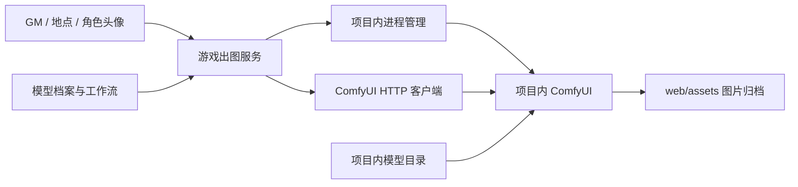

# 项目内生图

游戏的生图能力由工程内的 ComfyUI 提供。程序、Python/CUDA 依赖、Node.js 与模型都有本地副本，日常启动不依赖 `F:\ai` 或系统 Python。

## 目录与职责

```text
ai/
├── profiles.json              模型档案、组件清单与默认参数
├── workflows/                 ComfyUI API 工作流模板
├── bootstrap.py               项目内 Python 启动与依赖检查
├── requirements.lock.txt      当前 Windows / Python 3.10 依赖版本
├── vendor/ComfyUI/            第三方程序与原始许可证
├── runtime/
│   ├── python/                标准库、CUDA 与 Python 包
│   ├── node/                  游戏后端的 Node.js 与 npm
│   └── install.json           导入记录、模型大小和 SHA-256
├── models/
│   ├── diffusion_models/      图像生成主模型
│   ├── text_encoders/         提示词编码器
│   ├── vae/                   图像解码器
│   └── loras/                 模型附加权重
└── data/                      日志、输入、临时文件、缓存及 ComfyUI 用户数据

web/server/image/
├── profiles.js                档案读取与模板填充，无网络或进程操作
├── runtime.js                 启动、就绪探测、进程归属和关闭
├── comfyClient.js             节点校验、提交、轮询与获取 PNG
└── service.js                 游戏提示词、出图编排与图片归档
```

`web/server/comfy.js` 保留为兼容入口。GM、头像和地点出图都调用同一个服务，游戏规则与存档引擎不负责管理 Python 进程。



## 已导入的模型

当前可用档案为 `z-image-turbo`，对应本机原有的四个组件：

| 职责 | 文件 |
|---|---|
| 主模型 | `diffusion_models/z_image_turbo_bf16.safetensors` |
| Qwen3 文本编码器 | `text_encoders/qwen_3_4b.safetensors` |
| VAE | `vae/ae.safetensors` |
| LoRA | `loras/NSFW_master_ZIT.safetensors` |

默认配方保留 1024×1024、8 步、CFG 1 与原有 LoRA 强度。模型按出图任务载入，ComfyUI 自动管理显存。

`qwen-image-2512` 是独立档案，使用 Qwen-Image 主模型、Qwen2.5-VL 编码器与 Qwen-Image VAE。原 `F:\ai` 下没有这三个权重，所以设置中显示“模型待导入”，不能当作已经可用的 Qwen-Image。其标准工作流参数依据 [ComfyUI 官方示例](https://docs.comfy.org/tutorials/image/qwen/qwen-image-2512)；此档案尚未做实机生成验证。

## 启动与操作

在工程根目录运行 `启动游戏.bat`。它优先使用项目内 Node.js，游戏后端默认自动启动项目内 ComfyUI。关闭游戏后端时释放自己创建的出图进程。

游戏“设置 → 生图服务”支持模型选择、自动启动、状态检测和手动启停；检测与玩家存档独立。内部模式只监听 `127.0.0.1`，禁用联网 API 节点和自定义节点，并把模型、缓存和所有 ComfyUI 写入目录限制在 `ai/` 内。

配置的 `image_generation` 字段：

```json
{
  "mode": "internal",
  "auto_start": true,
  "profile": "z-image-turbo",
  "port": 8188,
  "startup_timeout": 120
}
```

外部连接模式使用原 `comfy_url`。项目不会终止外部 ComfyUI；内部端口若被另一套服务占用，会明确报错，允许更换内部端口或选择外部模式。切换内部端口前先停止当前项目进程。

## 导入与验证

源安装被复制保留。若需要重新建立本地副本，在已有 Node.js 的机器上执行：

```powershell
node scripts/import-image-runtime.mjs --source F:\ai
```

导入脚本识别原 Python 基础安装与 ComfyUI 环境，复制合并依赖、程序和模型，记录模型 SHA-256，并检查关键依赖是否都来自项目内。基础环境不能启动时会报错，不会生成“导入完成”的记录。

GPU 实机验证：

```powershell
.\ai\runtime\node\node.exe scripts/verify-image-runtime.mjs --size 1024
```

此脚本通过游戏出图服务生成一张普通场景图，检查 PNG 和尺寸，写入 `ai/data/smoke-result.json`，最后关闭自己创建的进程。它不修改玩家槽位，也不自动重复提交超时任务。

离线回归从 `web/` 执行 `npm test`，覆盖游戏原有行为和出图档案、配置、复制规则、生命周期及 HTTP 接口。常见错误查看 `ai/data/logs/comfyui.log`。

## 版本管理与打包

档案、工作流、启动脚本、依赖版本和服务代码进入 Git。`ai/vendor`、`ai/runtime`、`ai/models`、`ai/data` 是机器安装内容，已加入忽略规则；生成图片继续存放在 `web/assets`。

复制完整工程用于离线运行时，应同时携带这些本地目录及已安装的 Web 依赖。仅克隆 Git 的机器需先导入或安装运行时和模型。第三方原始许可证保留在各自目录内。
