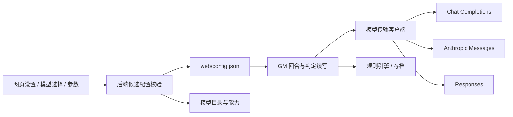

# 文字模型接入架构

游戏通过单一 GM 接口调用模型，模型服务负责生成剧情与结构化状态建议；规则引擎负责真实掷骰、状态校验与存档。切换服务不改变游戏规则。

## 代码职责

| 文件 | 职责 |
|---|---|
| `web/shared/llm.js` | 服务定义、参数默认值、思考与采样适用规则、参数校验；前后端共用 |
| `web/server/config.js` | 旧配置迁移、候选合并、密钥隔离、原子保存与掩码公开视图 |
| `web/server/llm/catalog.js` | 服务原生模型列表、完整分页、Go 参数能力、账号隔离缓存、模型描述 |
| `web/server/llm/catalog.snapshot.json` | 获取日期与来源明确的参考目录；无用户密钥，用于启动和网络失败回退 |
| `web/server/llm/client.js` | 三种原生请求格式、协议分流、JSON/SSE 解析、仅正文输出、同回合签名/加密内容续接 |
| `web/server/llm/redact.js` | 上游错误密钥脱敏，先脱敏再截断 |
| `web/server/gm.js` | 上下文、剧情 JSON、协议纠正、真实掷骰与续写；GMClient 保留统一接口 |
| `web/server/routes/config.js` | 配置读写、候选目录与连接测试；不回传模型测试正文 |
| `web/client/src/modelConfig.js` | 表单转换、切换服务/模型时重置参数、空密钥保留语义 |
| `SettingsModal.vue` | 搜索模型、能力标签、有效参数、候选连接测试；图片设置使用既有流程 |

## API 与协议

- `GET /api/config` 返回配置的公开视图、当前模型能力、参考/缓存目录；不返回完整密钥。
- `POST /api/config/models` 使用候选配置只读查询 `/models`，逐页取得全部条目；不保存候选配置。Go 访问 `/zen/go/v1/models`，公开能力目录不携带用户密钥。
- `POST /api/config/test` 以选定模型和参数发送短请求，最长 30 秒；不保存、不回传回复正文。
- `POST /api/config` 校验后原子写入，下一回合生效。切换服务、URL、认证方式或运行方式时不复用旧密钥。

DeepSeek 官方使用 Chat Completions。Go 的 Qwen/MiniMax 使用 Messages，GPT/Grok/Muse 使用 Responses，其余目录模型使用公布的 Chat Completions 接口。Go 的协议优先按其官方端点表处理，不能直接沿用普通 Zen 中同名模型的协议。Anthropic 兼容服务使用原生 Messages，支持 x-api-key、Bearer 和无需密钥。

模型描述包括精确 ID、协议、上下文与输出上限、思考模式、实际 effort 档位、预算能力及采样适用规则。DeepSeek 与 Anthropic 原生 `/models` 中的能力声明优先；Go 合并自身实时目录与 Models.dev 中的 Go 能力。未知高级能力不推测，关闭相应网页控件并省略对应请求字段。未来新接口协议需要增加明确的传输映射和本机 HTTP 回归用例。

## 回合连续性与失败处理

模型思考与剧情正文分开，reasoning_content、thinking blocks、reasoning summary 均不进入剧情流或存档。当前回合的客户端临时保留 Messages 签名块及 Responses 加密输出项，判定后续写复用原始内容；回合结束后释放。跨回合使用既有公开叙述历史与当前状态。

SSE 支持分包、UTF-8、CRLF、尾帧、协议完成标记与流内错误。网络提前结束、上游 error、token 截断会中止该回合，既有存档保持。不给残缺 JSON 应用状态变更；传输失败不自动重发请求，GM 仍保留既有的一次 JSON 协议纠正流程。目录读取失败明确提示回退目录；401/403 显示鉴权失败，不能把参考列表称为账号授权成功。

保存配置时，后端把当前模型已确认的能力存入内部字段 `llm_model_info`，绑定服务、地址、密钥哈希与模型 ID。新增模型在重启后仍可恢复合法的参数；切换地址、密钥或模型不会借用旧能力。网页提交不能覆盖这一内部字段。

## 验证与资料

`npm.cmd --prefix web run verify` 覆盖规则一致性和全部回归；模型测试使用独立本机假服务或 fetch 替身。网页构建用 `npm.cmd --prefix web/client run build`。真实账号密钥填写后再用网页测试确认账户授权与实际生成能力。

参考：[DeepSeek 参数](https://api-docs.deepseek.com/api/create-chat-completion/)、[DeepSeek 模型能力](https://api-docs.deepseek.com/api/list-models/)、[OpenCode Go](https://opencode.ai/docs/go/)、[OpenCode 模型配置与 Models.dev](https://opencode.ai/docs/models/)、[Anthropic 模型能力](https://platform.claude.com/docs/en/api/models/list)、[Anthropic effort](https://platform.claude.com/docs/en/build-with-claude/effort)、[Anthropic 思考预算](https://platform.claude.com/docs/en/build-with-claude/extended-thinking)。
